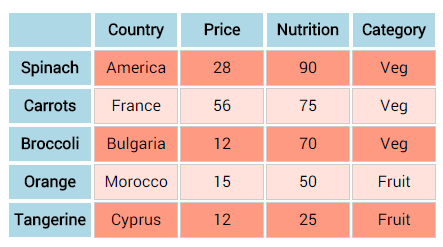

# CodeInstitute

Interactive Frontend Development - From JavaScript to jQuery

## jQuery Introduction - writing and manipulating a table using jQuery

### Items I covered on this course:

1.  Using jQuery library file in a project 
    -   Downloaded and added the jQuery library to the project jQueryTable
    -   Referenced the library in table.html header

2.  Manipulated h2 and ul elements

3.  Added new classes to inline css, to avoid permanent changes to the elements

4.  Added the classes to js file

#### Challenge

Complete the table according to the example below

1.  Added content to the table.html according to the example

2.  Checked the targeted table content in browser dev tools

3.  Obtained the colors using Digital Color Meter

4.  Tested the colors in browser dev tools

5.  Added new classes in inline <style> for odd and even rows on the table

6.  Added the classes to the js file

